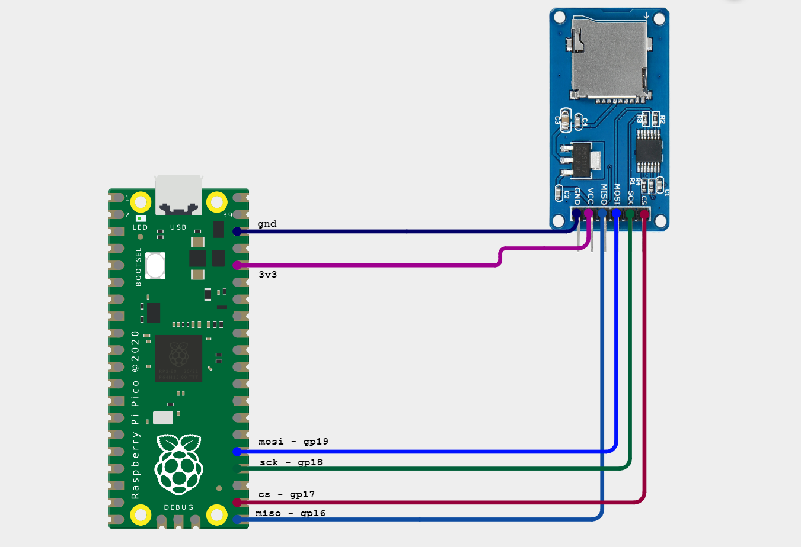

I have been unable to verify that the raspberry pi pico can communicate with the sd module.

I started off trying to write to a sector on the sd card (it won't come up as a file when you mout it on a computer but would indicate if writing was successful.) That failed so I wanted to write a viewable .csv file to the card, so i can verify.


Continually ran into this error  

```
14:32:22.883 -> 
14:32:22.883 -> --- SD FAT32 CSV write test ---
14:32:23.896 -> f_mount failed, error code 3
14:32:23.896 -> (Check wiring first -- FatFs sees the same SPI bus as before.)
```

I've tried a handful of things. I took down one of my old projects so I could verify the module itself was not the issue. My old module still gave the same bug. I reduced the spi clock in `hw_config` to 400kHz but still the same error.  

I tried powering the module from the pico's vbus(pin 40, 5V) in case 3v3 was not strong enough for the module but nothing was forthcoming.  

I've attached a schematic diagram of my current setup.

 


The `no-OS-FatFs-SD-SPI-RPi-Pico` subfolder was had sub file names too long to upload to github. you can verify it here [carlk3 sd card file allocation system](https://github.com/carlk3/no-OS-FatFS-SD-SPI-RPi-Pico)  

Currently considering a solution highlighted in the carlk3's forum.  
